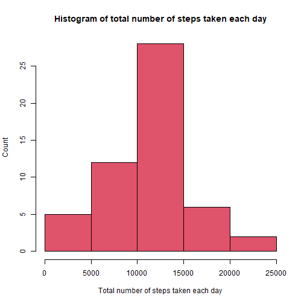

## Loading and preprocessing the data
1. Load the data (i.e. read.csv())
2. Process/transform the data (if necessary) into a format suitable for your analysis


```r
#Load the data 
file <- unzip("activity.zip", overwrite = TRUE)
rawdata <- read.csv(file, header=TRUE, sep=",", colClasses = c("integer", "Date", "integer"), stringsAsFactors = FALSE)
#Process/transform the data
activities <- na.omit(rawdata)
```

## What is mean total number of steps taken per day?
1. Make a histogram of the total number of steps taken each day
2. Calculate and report the mean and median total number of steps taken per day


```r
library(dplyr)
```

```
## 
## Attaching package: 'dplyr'
```

```
## The following objects are masked from 'package:stats':
## 
##     filter, lag
```

```
## The following objects are masked from 'package:base':
## 
##     intersect, setdiff, setequal, union
```

```r
#group steps by days and sum
stepsperday <- activities %>% group_by(date) %>% summarise(Totalsteps = sum(steps))
#histogram of the total number of steps taken each day
hist(stepsperday$Totalsteps,
     xlab="Total number of steps taken each day", 
     ylab="Count", 
     main="Histogram of total number of steps taken each day",
     col=2)
```



```r
#the mean and median total number of steps taken per day
meanstepsperday <- mean(stepsperday$Totalsteps)
medianstepsperday <- median(stepsperday$Totalsteps)
```

The mean step per day are 10766.1886792453 and the median 10765.

##What is the average daily activity pattern?

1. Make a time series plot (i.e. type = "l") of the 5-minute interval (x-axis)
and the average number of steps taken, averaged across all days (y-axis)
2. Which 5-minute interval, on average across all the days in the dataset,
contains the maximum number of steps?


```r
#Make a time series plot (i.e. type = "l") of the 5-minute interval (x-axis)
#and the average number of steps taken, averaged across all days (y-axis)
averageSteps <- activities %>% group_by(interval) %>% summarise(avg = mean(steps))
plot(averageSteps$interval, averageSteps$avg, type= "l", xlab="Interval", ylab="average")
```


```r
#Which 5-minute interval, on average across all the days in the dataset,
#contains the maximum number of steps?
maxaveragesteps <- averageSteps[averageSteps$avg == max(averageSteps$avg),]
```
The maximum average steps are contained in the interval 835.

##Imputing missing values
1. Calculate and report the total number of missing values in the dataset (i.e. the total number of rows with NAs)
2. Devise a strategy for filling in all of the missing values in the dataset. The strategy does not need to be sophisticated. For example, you could use the mean/median for that day, or the mean for that 5-minute interval, etc.
3. Create a new dataset that is equal to the original dataset but with the missing data filled in.
4. Make a histogram of the total number of steps taken each day and Calculate and report the mean and median total number of steps taken per day. Do these values differ from the estimates from the first part of the assignment? What is the impact of imputing missing data on the estimates of the total
daily number of steps?


```r
#compute rwos with NA
narows <- sum(is.na(rawdata$steps))
#fill NA values with the mean of the same interval
library(dplyr)
filleddata <- rawdata
filleddata <- filleddata %>% mutate(steps = ifelse(
                                is.na(steps), 
                                as.integer(filter(averageSteps, averageSteps$interval==interval)$avg),
                                steps
                      )
              )
stepsbyday <- filleddata %>% group_by(date) %>% summarise(TotalSteps = sum(steps))
hist(stepsbyday$TotalSteps, 
     xlab="Total number of steps taken each day", 
     ylab="Count", 
     main="Histogram of total number of steps taken each day",
     col=3
     )
```


The number of rows with NA value are 2304.

##Are there differences in activity patterns between weekdays and weekends?


```r
library(lubridate)
```

```
## 
## Attaching package: 'lubridate'
```

```
## The following objects are masked from 'package:base':
## 
##     date, intersect, setdiff, union
```

```r
filleddata <- filleddata %>% 
        mutate(datetype = ifelse(
                                wday(date, week_start = 1) %in% c(6,7),
                                "weekend",
                                "weekday"
                                )
                )
#trasform to factor
filleddata$datetype <- as.factor(filleddata$datetype)
stepsbyweekday <- filleddata %>% group_by(interval, datetype) %>% summarise(avgSteps = mean(steps))
```

```
## `summarise()` has grouped output by 'interval'. You can override using the `.groups` argument.
```

```r
#plot data
library(ggplot2)
```

```
## Keep up to date with changes at https://www.tidyverse.org/blog/
```

```r
gp <- ggplot(stepsbyweekday, 
            aes(interval, avgSteps)
            ) + 
        facet_grid(datetype ~ .) + 
        geom_line(color="black") +
        ggtitle("Average steps taken Weekday vs Weekend") +
        labs(y = "Steps average", x = "Interval")
print(gp)
```


